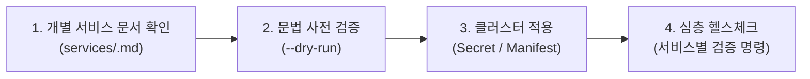

# Homelab Infra - Agent Guidelines (`AGENTS.md`)

이 문서는 **Homelab Infra** 프로젝트에서 AI 에이전트(Antigravity)가 작업을 수행할 때 지켜야 하는 **핵심 행동 규칙(Rules)**과 작업별 **참조 문서 길잡이(Route Map)**를 정의합니다. 본 문서는 단순 설명서가 아닌 에이전트의 판단과 실행을 통제하는 행동 지침서입니다.

---

## 1. 프로젝트 정체성 및 미션

- **목적**: 백엔드(NestJS 등) 및 마이크로서비스 아키텍처(MSA) 실험을 위한 개인 홈랩 인프라 관리.
- **아키텍처**:
  - **호스트**: Windows Desktop WSL2 Ubuntu (`192.168.0.10`) 기반 경량 Kubernetes(**k3s**).
  - **제어 환경**: MacBook 개발 머신에서 `kubectl` 및 Ansible을 통해 원격 제어.
- **핵심 운영 철학**:
  - **Scale to 0**: 리소스 절약을 위해 미사용 컴포넌트는 언제든 안전하게 끄고 켤 수 있어야 함 (볼륨 데이터 보존).
  - **시크릿 격리**: `.env.*` 파일과 Kubernetes Secret을 통해 형상 관리(Git)에 민감 정보가 유출되지 않도록 완벽 차단.

---

## 2. 작업별 참조 문서 길잡이 (Routing Map)

작업 유형에 따라 아래의 문서를 **반드시 먼저 확인(`view_file`)한 후** 작업을 수행하십시오.

| 작업 대상 / 목적 | 참조해야 할 문서 | 주요 포함 내용 |
| :--- | :--- | :--- |
| **전체 인프라 서비스 요약 인덱스** | [`.agents/references/services/README.md`](file:///Users/limkeunhyeok/workspace/homelab-infra/.agents/references/services/README.md) | 6대 서비스의 워크로드, 포트, 내부 FQDN, 볼륨, 상세 문서 링크 요약 |
| **개별 서비스 상세 스펙 및 런북** | [`.agents/references/services/`](file:///Users/limkeunhyeok/workspace/homelab-infra/.agents/references/services/) 하위 문서 - [`postgres.md`](file:///Users/limkeunhyeok/workspace/homelab-infra/.agents/references/services/postgres.md) - [`mongo.md`](file:///Users/limkeunhyeok/workspace/homelab-infra/.agents/references/services/mongo.md) - [`minio.md`](file:///Users/limkeunhyeok/workspace/homelab-infra/.agents/references/services/minio.md) - [`opensearch.md`](file:///Users/limkeunhyeok/workspace/homelab-infra/.agents/references/services/opensearch.md) - [`rabbitmq.md`](file:///Users/limkeunhyeok/workspace/homelab-infra/.agents/references/services/rabbitmq.md) - [`redis.md`](file:///Users/limkeunhyeok/workspace/homelab-infra/.agents/references/services/redis.md) | 개별 서비스의 환경변수 스키마, 볼륨 마운트 경로, 헬스체크 명령, 포트포워딩 및 운영 런북 |
| **클러스터 운영, 시크릿 및 자원 제어** | [`.agents/references/cluster-ops.md`](file:///Users/limkeunhyeok/workspace/homelab-infra/.agents/references/cluster-ops.md) | Ansible 프로비저닝, 시크릿 일괄 생성 명령, Scale to 0/Up 루틴, 로컬 포트포워딩 가이드, 클러스터 장애 진단 |
| **호스트 인벤토리 및 플레이북** | [`inventory/hosts.ini`](file:///Users/limkeunhyeok/workspace/homelab-infra/inventory/hosts.ini) [`playbooks/install-k3s.yml`](file:///Users/limkeunhyeok/workspace/homelab-infra/playbooks/install-k3s.yml) | 대상 서버 IP(`192.168.0.10`), SSH 사용자 계정, k3s 설치 매개변수 및 맥북용 kubeconfig 연동 로직 |

---

## 3. 에이전트 행동 골든 룰 (Golden Rules)

에이전트는 어떠한 상황에서도 아래 6대 원칙을 절대 위반해서는 안 됩니다.

### [Rule 1] 명시적 승인 없는 임의 처리 금지 (Explicit Approval First)
- **질의와 실행의 엄격한 분리**: 사용자가 의견을 묻거나 방안을 검토하는 질문을 했을 때, 사용자의 명시적인 작성/수정/실행 명령이나 승인이 내려지지 않았다면 절대 먼저 파일을 생성·수정하거나 명령을 실행하지 마십시오.
- **의견 및 계획 우선 제시**: 단순 질의나 방향성 논의에는 분석, 의견, 계획만 답변하십시오. 반드시 사용자가 "진행해 달라", "작성해 줘" 등의 명확한 승인을 내린 후에만 실제 변경 및 구현 작업에 착수하십시오.

### [Rule 2] 영속성 데이터 보호 (PVC & Storage Preservation)
- **PVC 임의 삭제 절대 금지**: `kubectl delete pvc` 또는 데이터가 저장된 PV/호스트 디렉토리를 삭제하는 명령을 직접 실행하지 마십시오.
- **StatefulSet 볼륨 불변성**: `volumeClaimTemplates` 및 스토리지 클래스(`local-path`) 설정은 임의로 수정할 수 없습니다. 변경이 필요하면 반드시 사용자에게 사전에 알리고 승인을 받으십시오.

### [Rule 3] 환경 변수 및 시크릿 격리 엄수
- **평문 비밀번호 커밋 금지**: `.env.*` 파일은 Git 추적에서 제외되어 있습니다. YAML 매니페스트 내부에 비밀번호, 키파일 등을 평문(`stringData`/`data`)으로 하드코딩하여 커밋하지 마십시오. (단, mongo 내부 통신용 더미 키파일 등 예외 제외)
- **키 이름 정합성**: 매니페스트의 `secretKeyRef` 또는 `envFrom`에서 참조하는 키 이름은 반드시 해당 서비스의 참조 문서([`.agents/references/services/<service>.md`](file:///Users/limkeunhyeok/workspace/homelab-infra/.agents/references/services/))의 명세와 일치해야 합니다.
- **파드 환경변수 위임 및 비밀번호 확인**: 헬스체크나 파드 점검 시에는 하드코딩된 비밀번호 대신 파드 내부 환경변수(`$REDIS_PASSWORD` 등)를 우선 활용하십시오. 실제 비밀번호 조회가 필요한 경우에는 Git에서 격리된 로컬 `k8s/<service>/.env.<service>` 또는 Kubernetes Secret을 참조하십시오.

### [Rule 4] 명시적 네임스페이스 및 클러스터 컨텍스트 확인
- **네임스페이스 고정**: 모든 인프라 워크로드는 공통 네임스페이스 **`infra`**에 격리됩니다. 모든 kubectl 명령 및 신규 매니페스트 작성 시 반드시 `-n infra` 또는 `metadata.namespace: infra`를 명시하십시오.
- **원격 엔드포인트 점검**: 맥북 로컬 작업 시 현재 kubeconfig 컨텍스트가 `https://192.168.0.10:6443`을 가리키고 있는지 항상 확인하십시오.

### [Rule 5] MongoDB Replica Set 스케일 복원 원칙
- MongoDB는 3개 노드로 묶인 Replica Set(`rs0`)입니다. 리소스 절약을 위해 Scale to 0을 했다가 다시 올릴 때는 반드시 **`--replicas=3`**으로 복구해야 정족수(Quorum)가 정상 작동합니다.

### [Rule 6] 배포 전/후 검증 의무
- 매니페스트 수정 시 먼저 `kubectl apply --dry-run=client -f <path>`로 구문 오류를 검증하십시오.
- 배포 후에는 단순 Pod Running 확인에 그치지 않고, 해당 서비스의 참조 문서([`.agents/references/services/<service>.md`](file:///Users/limkeunhyeok/workspace/homelab-infra/.agents/references/services/))에 명시된 서비스별 헬스체크 명령을 실행하여 실제 응답 여부를 확인하십시오.

---

## 4. 표준 작업 라이프사이클 (Operating Routine)

에이전트가 인프라 수정이나 배포 작업을 수행할 때는 다음 루틴을 따릅니다.

1. **사전 조사 (Route Check)**:
   - 변경하려는 서비스의 기존 구조와 `.env` 키 명세를 [`.agents/references/services/<service>.md`](file:///Users/limkeunhyeok/workspace/homelab-infra/.agents/references/services/)에서 확인합니다.
2. **사전 검증 (Pre-verification)**:
   - `kubectl apply --dry-run=client -f <path>`
3. **적용 (Execution)**:
   - 시크릿 변경 시 `kubectl create secret generic ... --dry-run=client -o yaml | kubectl apply -f -`로 갱신.
   - 서비스 매니페스트 적용: `kubectl apply -f <path>`
4. **심층 검증 (Post-verification)**:
   - 파드 정상 기동 확인: `kubectl get pods -n infra`
   - 서비스별 헬스체크 명령 실행 (예: redis-cli ping, pg_isready, rs.status 등).

---

## 5. 신규 인프라 서비스 추가 시 체크리스트

신규 서비스(예: Kafka 등)를 추가할 때는 다음 컨벤션을 반드시 준수해야 합니다:
1. `k8s/<service>/` 디렉토리 생성.
2. `k8s/<service>/.env.<service>` 파일 작성 (민감 정보 포함, Git 추적 제외 확인).
3. `k8s/<service>/<service>.yaml` 매니페스트 작성:
   - `namespace: infra` 지정
   - `storageClassName: local-path` 사용
   - `secretRef` 또는 `secretKeyRef`로 `<service>-secret` 참조
4. 클러스터에 Secret 등록 및 매니페스트 배포.
5. 신규 서비스 상세 문서 작성: `.agents/references/services/<service>.md`.
6. [`.agents/references/services/README.md`](file:///Users/limkeunhyeok/workspace/homelab-infra/.agents/references/services/README.md) 요약표에 신규 서비스 정보 추가.
