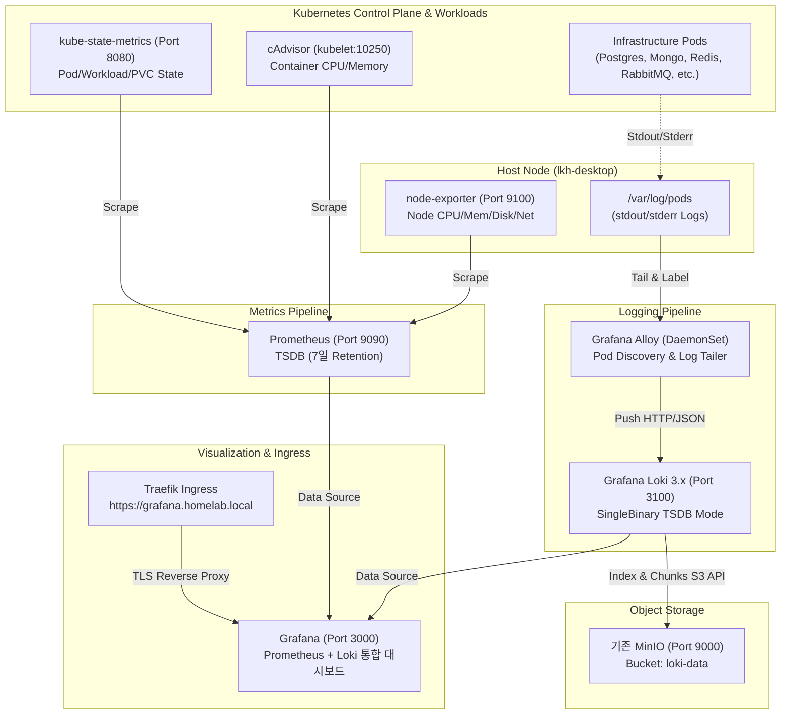

# 모니터링 및 로깅 시스템 운영 명세서 (`monitoring.md`)

- **매니페스트 경로**: 
  - Prometheus: `k8s/prometheus/`
  - node-exporter: `k8s/node-exporter/`
  - kube-state-metrics: `k8s/kube-state-metrics/`
  - Loki: `k8s/loki/`
  - Alloy: `k8s/alloy/`
  - Grafana: `k8s/grafana/`
- **환경 변수 경로**: `k8s/grafana/.env.grafana` (Git 추적 제외)
- **네임스페이스**: `infra`
- **접속 도메인**: `https://grafana.homelab.local`

---

## 1. 개요 및 관측성 아키텍처 (Architecture)

Homelab k3s 환경에서 노드 및 파드의 시스템 자원(Metrics)과 컨테이너 stdout/stderr 로그(Logs)를 실시간으로 수집·저장·시각화하는 통합 관측성(Observability) 시스템입니다.



---

## 2. 세부 컴포넌트 구성 및 역할

| 컴포넌트 | 워크로드 유형 | 이미지 | 주요 역할 및 수집 대상 |
| :--- | :--- | :--- | :--- |
| **Prometheus** | Deployment (1 Replicas) | `prom/prometheus:v3.2.1` | node-exporter, kube-state-metrics, cAdvisor 메트릭 스크랩 및 TSDB 저장 |
| **node-exporter** | DaemonSet | `prom/node-exporter:v1.9.0` | 호스트 노드 하드웨어 메트릭 (CPU, RAM, 디스크 I/O, 네트워크) |
| **kube-state-metrics** | Deployment (1 Replicas) | `registry.k8s.io/...:v2.15.0` | 쿠버네티스 리소스 상태 (Pod Phase, Deployment Replica, PVC 등) |
| **Loki** | Deployment (1 Replicas) | `grafana/loki:3.4.2` | SingleBinary TSDB 모드, MinIO S3 연동 로그 인덱싱 및 쿼리 |
| **Alloy** | DaemonSet | `grafana/alloy:v1.7.1` | `/var/log/pods` 실시간 테일링, 메타데이터 라벨링 후 Loki 푸시 |
| **Grafana** | Deployment (1 Replicas) | `grafana/grafana:11.5.2` | Prometheus 및 Loki 데이터소스 기반 메트릭/로그 통합 시각화 |

---

## 3. Loki와 MinIO Object Storage 연동

- **원칙**: 기존 MinIO의 데이터 및 버킷에 일체 영향을 주지 않고, 독립된 버킷 `loki-data`를 전용으로 사용.
- **S3 엔드포인트**: `http://minio-service.infra.svc.cluster.local:9000`
- **인증 정보 연동**:
  - `minio-secret`의 `MINIO_ROOT_USER`, `MINIO_ROOT_PASSWORD`를 환경변수로 주입.
  - Loki 실행 시 `-config.expand-env=true` 옵션으로 평문 노출 없이 안전하게 인증 처리.
- **저장 구조**:
  - `s3forcepathstyle: true`, `insecure: true`
  - TSDB 인덱스(`index/`) 및 로그 청크(`fake/` 등)가 MinIO `loki-data` 버킷에 보관됨.

---

## 4. 스토리지 및 보존(Retention) 정책

Homelab 리소스(디스크 및 메모리)의 안정적인 운영을 위해 컴팩트한 Retention 정책을 적용합니다.

| 서비스 | PVC 용량 | StorageClass | 보존 기간(Retention) | 비고 |
| :--- | :--- | :--- | :--- | :--- |
| **Prometheus** | 10Gi (`prometheus-pvc`) | `local-path` | **7일** (`--storage.tsdb.retention.time=7d`) | TSDB 로컬 볼륨 자동 만료 |
| **Loki** | 5Gi (`loki-pvc`) | `local-path` | **7일** (`retention_period: 168h`) | Compactor가 MinIO 내 7일 경과 청크/인덱스 정리 |
| **Grafana** | 2Gi (`grafana-pvc`) | `local-path` | 영구 (데이터베이스) | 대시보드, 유저 세션 영속화 |

---

## 5. Grafana 접속 및 로그/메트릭 조회 방법

### 5.1 웹 콘솔 접속
- **URL**: `https://grafana.homelab.local`
- **관리자 계정**: `admin`
- **비밀번호**: `<your-secure-password>` (환경변수 `k8s/grafana/.env.grafana`에 정의)

### 5.2 사전 프로비저닝 데이터 소스
- **Prometheus** (기본): `http://prometheus-service.infra.svc.cluster.local:9090`
- **Loki**: `http://loki-service.infra.svc.cluster.local:3100`

### 5.3 Explore 메뉴에서 파드 로그 조회 예시
Grafana 좌측 메뉴의 **Explore**로 이동하여 데이터 소스를 **Loki**로 선택 후 다음과 같이 LogQL 질의를 수행합니다:

1. **인프라 네임스페이스 전체 로그**:
   ```logql
   {namespace="infra"}
   ```
2. **PostgreSQL 로그 실시간 스트리밍**:
   ```logql
   {container="postgres"}
   ```
3. **MongoDB 로그 중 에러 필터링**:
   ```logql
   {container="mongodb"} |= "error"
   ```
4. **특정 파드(Alloy) 로그 조회**:
   ```logql
   {app="alloy"}
   ```

---

## 6. 검증 및 운영 런북 (Operations & Runbook)

### 6.1 모니터링 스택 헬스체크
```bash
make check-monitoring
```
- Prometheus, Loki, Grafana, Alloy의 가용성을 원클릭으로 점검합니다.

### 6.2 Scale to 0 / Scale Up (절전 모드)
`Makefile`의 통합 제어를 지원합니다:
- **전체 정지 (Scale to 0)**:
  ```bash
  make stop
  ```
  *(Prometheus, Loki, Grafana가 0으로 축소되며 PVC 볼륨과 MinIO 로그 데이터는 안전 보존됩니다)*
- **전체 기동 (Scale Up)**:
  ```bash
  make start
  ```

### 6.3 Prometheus Scrape 타깃 상태 확인
```bash
kubectl exec -n infra deploy/prometheus -- wget -q -O - http://localhost:9090/api/v1/targets
```

### 6.4 MinIO 내 Loki 로그 적재 현황 확인
```bash
kubectl exec -n infra deploy/minio -- mc ls local/loki-data
```

---

## 7. 아키텍처 결정 및 향후 확장 영역

### 7.1 현재 구성에서 제외한 컴포넌트 및 사유
- **Grafana Tempo / Mimir**: 분산 트레이싱과 장기 시계열 저장을 위한 컴포넌트이나, 다중 마이크로서비스 간 분산 호출 추적이 본격화되지 않은 현재 Homelab 단계에서는 과도한 메모리/스토리지 오버헤드를 유발하므로 배제함.
- **OpenTelemetry Agent**: 표준 OTel 대신 Grafana 생태계의 최신 공식 수집기인 **Grafana Alloy**를 단일 에이전트로 채택하여 로그 수집과 향후 메트릭 파이프라인 확장을 일원화함.

### 7.2 향후 확장 가능한 영역
1. **경보 시스템 (Alertmanager)**: 슬랙/디스코드 웹훅과 연동하여 노드 디스크 고갈 또는 파드 재시작 경보 구성.
2. **DB 전용 심층 Exporter (선택 사항)**: 테이블별 I/O나 쿼리 지연시간 추적이 필요할 때 `postgres-exporter` 등을 사이드카로 도입.
3. **Grafana Dashboards 고도화**: 대시보드 JSON을 ConfigMap으로 추가 등록하여 클러스터 리소스 오버뷰 자동 로딩.
