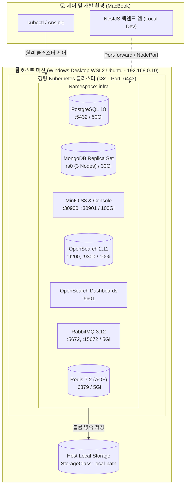

# 🏠 Homelab Infrastructure

> **NestJS 백엔드 및 마이크로서비스 아키텍처(MSA) 실험을 위한 자원 효율적인 경량 Kubernetes(k3s) 홈랩 인프라**

---

## 📌 프로젝트 소개

이 프로젝트는 개인 개발 환경에서 다양한 백엔드 아키텍처(Event-Driven, 분산 트랜잭션, 검색 엔진, 캐싱, 객체 스토리지 등)를 실제 프로덕션과 유사하게 검증하기 위해 구축된 **개인 홈랩 인프라 저장소**입니다.

### 핵심 설계 철학
- 💡 **자원 최적화 (Scale to 0)**: 물리 머신의 한정된 메모리와 CPU 자원을 효율적으로 쓰기 위해 미사용 서비스는 언제든 안전하게 정지시키고(0 pods), 필요할 때 즉시 복구할 수 있습니다 (데이터 영속성 보장).
- 🔒 **철저한 시크릿 격리**: 모든 접속 암호와 설정은 `.env.*` 파일과 Kubernetes Secret으로 격리 관리되어 코드 저장소(Git)에 민감 정보가 유출되지 않습니다.
- 🚀 **하이브리드 원격 제어**: 고사양 Windows Desktop(WSL2)의 연산/디스크 자원을 활용하고, 제어 및 백엔드 개발은 MacBook에서 원격(`kubectl` / `ansible`)으로 편리하게 수행합니다.

---

## 🏗️ 인프라 토폴로지



---

## 📦 인프라 서비스 스택

모든 워크로드는 공통 네임스페이스 **`infra`**에 배포되며, k3s 내장 **`local-path`** 스토리지 클래스를 통해 호스트 디스크에 안전하게 영속 저장됩니다.

| 서비스 | 워크로드 유형 | 복제본 | 스토리지 (PVC) | 주요 포트 (내부 / 외부) | Ingress 도메인 (Host) | 상세 런북 |
| :--- | :--- | :---: | :--- | :--- | :--- | :---: |
| **PostgreSQL** | Deployment | 1 | 50Gi (`postgres-pvc`) | ClusterIP `5432` | *(L4 TCP)* | [문서 보기](.agents/references/services/postgres.md) |
| **MongoDB** | StatefulSet | 3 | 10Gi x 3 (`mongodata`) | ClusterIP `27017` (`rs0` 3노드 복제셋) | *(L4 TCP)* | [문서 보기](.agents/references/services/mongo.md) |
| **MinIO** | Deployment | 1 | 100Gi (`minio-pvc`) | S3: `30900` (NodePort)<br>Console: `30901` (NodePort) | `minio.homelab.local`<br>`s3.homelab.local` | [문서 보기](.agents/references/services/minio.md) |
| **OpenSearch** | StatefulSet | 1 | 10Gi (`opensearch-storage`) | ClusterIP `9200` (REST), `9300` (Node) | `opensearch.homelab.local` | [문서 보기](.agents/references/services/opensearch.md) |
| **Dashboards** | Deployment | 1 | - | ClusterIP `5601` | `dashboards.homelab.local` | [문서 보기](.agents/references/services/opensearch.md) |
| **RabbitMQ** | StatefulSet | 1 | 5Gi (`rabbitmq-storage`) | AMQP `5672`<br>Web UI `15672` | `rabbitmq.homelab.local` | [문서 보기](.agents/references/services/rabbitmq.md) |
| **Redis** | StatefulSet | 1 | 5Gi (`redis-storage`) | ClusterIP `6379` (AOF 활성화) | *(L4 TCP)* | [문서 보기](.agents/references/services/redis.md) |

---

## 🚀 빠른 시작 가이드 (Quick Start)

### 1. 사전 준비 (Prerequisites)
- 맥북에 `kubectl` 및 `ansible` 설치 필요.
- 호스트 머신(Windows Desktop `192.168.0.10`)의 WSL2에 SSH 접근 가능해야 함.

### 2. k3s 클러스터 프로비저닝 (최초 1회)
Ansible 플레이북을 통해 k3s를 설치하고 맥북의 `~/.kube/config`를 자동으로 연동합니다.
```bash
ansible-playbook playbooks/install-k3s.yml
```

### 3. 네임스페이스 및 시크릿 생성
각 `k8s/<service>/.env.<service>` 파일의 설정값을 Kubernetes Secret으로 등록합니다.
```bash
# 네임스페이스 보장
kubectl create namespace infra --dry-run=client -o yaml | kubectl apply -f -

# 각 서비스별 시크릿 등록
kubectl create secret generic postgres-secret --from-env-file=k8s/postgres/.env.postgres -n infra
kubectl create secret generic mongo-secret --from-env-file=k8s/mongo/.env.mongo -n infra
kubectl create secret generic minio-secret --from-env-file=k8s/minio/.env.minio -n infra
kubectl create secret generic opensearch-secret --from-env-file=k8s/opensearch/.env.opensearch -n infra
kubectl create secret generic rabbitmq-secret --from-env-file=k8s/rabbitmq/.env.rabbitmq -n infra
kubectl create secret generic redis-secret --from-env-file=k8s/redis/.env.redis -n infra
```

### 4. 서비스 및 Ingress 배포
```bash
# 인프라 서비스 배포
kubectl apply -f k8s/postgres/postgres.yaml
kubectl apply -f k8s/mongo/mongo.yaml
kubectl apply -f k8s/minio/minio.yaml
kubectl apply -f k8s/opensearch/opensearch.yaml
kubectl apply -f k8s/rabbitmq/rabbitmq.yaml
kubectl apply -f k8s/redis/redis.yaml

# Ingress 라우팅 배포 (Traefik)
kubectl apply -f k8s/ingress/infra-ingress.yaml
```

---

## ⚡ 자원 절약 및 일상 운영 (Makefile 활용)

홈랩 리소스를 절약하고 싶을 때는 `Makefile`을 통해 단 한 줄로 전체 또는 개별 서비스를 끄고 켤 수 있습니다. **(PVC에 저장된 데이터는 완벽히 보존됩니다)**

```bash
# 1. 인프라 전체 상태 조회 (파드, PVC, Ingress)
make status

# 2. 전체 서비스 일시 정지 (Scale to 0) / 기동 (Scale Up)
make stop     # 전체 정지
make start    # 전체 기동 (MongoDB 3노드 정족수 자동 보장)

# 3. 개별 서비스 선택적 On / Off
make start-postgres    / make stop-postgres
make start-mongo       / make stop-mongo
make start-minio       / make stop-minio
make start-opensearch  / make stop-opensearch
make start-rabbitmq    / make stop-rabbitmq
make start-redis       / make stop-redis

# 4. 전체 서비스 헬스체크
make check
```

<details>
<summary><b>kubectl 명령어로 직접 제어하기 (클릭하여 펼치기)</b></summary>

```bash
# 전체 서비스 일시 정지 (Scale down)
kubectl scale deployment postgres minio opensearch-dashboards --replicas=0 -n infra
kubectl scale statefulset mongodb opensearch rabbitmq redis --replicas=0 -n infra

# 전체 서비스 재가동 (Scale up)
kubectl scale deployment postgres minio opensearch-dashboards --replicas=1 -n infra
kubectl scale statefulset opensearch rabbitmq redis --replicas=1 -n infra
kubectl scale statefulset mongodb --replicas=3 -n infra     # ⚠️ MongoDB는 반드시 3노드로 복원
```
</details>

---

## 🔌 맥북 로컬 개발 시 포트포워딩

MinIO(NodePort)를 제외한 서비스들은 클러스터 내부용(`ClusterIP`)이므로, 맥북 로컬 개발 시 아래 명령어로 로컬 포트에 연결합니다.

```bash
# PostgreSQL (로컬 5432)
kubectl port-forward -n infra svc/postgres-service 5432:5432

# Redis (로컬 6379)
kubectl port-forward -n infra svc/redis-service 6379:6379

# MongoDB (로컬 27017)
kubectl port-forward -n infra svc/mongodb-service 27017:27017

# RabbitMQ (AMQP 5672 / Web UI 15672)
kubectl port-forward -n infra svc/rabbitmq-service 5672:5672 15672:15672

# OpenSearch (로컬 9200) 및 Dashboards (로컬 5601)
kubectl port-forward -n infra svc/opensearch-service 9200:9200
kubectl port-forward -n infra svc/opensearch-dashboards-service 5601:5601
```

---

## 📂 디렉토리 구조

```text
homelab-infra/
├── .agents/
│   ├── AGENTS.md                  # AI 에이전트 핵심 행동 규칙 및 라우터
│   └── references/
│       ├── cluster-ops.md         # 클러스터 운영, Ansible, 트러블슈팅 상세
│       └── services/              # 6대 인프라 서비스별 상세 스펙 및 런북
│           ├── README.md          # 전체 서비스 요약 인덱스
│           ├── postgres.md        # PostgreSQL 운영 명세서
│           ├── mongo.md           # MongoDB Replica Set 운영 명세서
│           ├── minio.md           # MinIO S3 운영 명세서
│           ├── opensearch.md      # OpenSearch/Dashboards 운영 명세서
│           ├── rabbitmq.md        # RabbitMQ 운영 명세서
│           └── redis.md           # Redis 운영 명세서
├── Makefile                       # 일상 인프라 운영 자동화 (status, start, stop, check 등)
├── ansible.cfg                    # Ansible 기본 설정
├── inventory/
│   └── hosts.ini                  # 호스트 서버 인벤토리 (192.168.0.10)
├── playbooks/
│   └── install-k3s.yml            # k3s 클러스터 프로비저닝 플레이북
├── scripts/
│   ├── setup-hosts.sh             # 맥북 /etc/hosts 자동 등록 스크립트 (중복 방지)
│   └── windows/
│       └── portproxy.bat          # Windows 재부팅 시 WSL2 포트포워딩 복구 배치 스크립트
└── k8s/                           # 서비스별 Kubernetes 매니페스트 및 .env 템플릿
    ├── ingress/                   # Ingress 라우팅 매니페스트 (Traefik)
    ├── minio/                     # minio.yaml, .env.minio.example
    ├── mongo/                     # mongo.yaml, .env.mongo.example
    ├── opensearch/                # opensearch.yaml, .env.opensearch.example
    ├── postgres/                  # postgres.yaml, .env.postgres.example
    ├── rabbitmq/                  # rabbitmq.yaml, .env.rabbitmq.example
    └── redis/                     # redis.yaml, .env.redis.example
```

---

## 📚 관련 문서 바로가기
- **[에이전트 행동 지침서 (`AGENTS.md`)](.agents/AGENTS.md)**: AI 에이전트의 판단 원칙, 6대 골든 룰 및 작업 라이프사이클.
- **[클러스터 운영 가이드 (`cluster-ops.md`)](.agents/references/cluster-ops.md)**: 호스트 환경, 시크릿 관리, Scale to 0, 장애 진단.
- **[서비스별 상세 런북 (`services/`)](.agents/references/services/README.md)**: 데이터베이스 및 메시지 브로커별 세부 명세.
